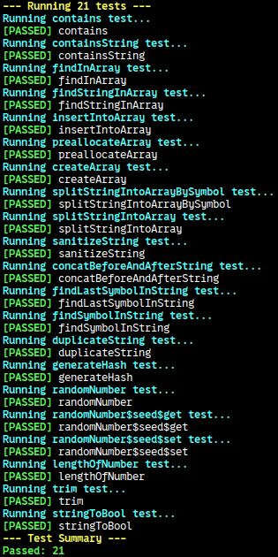

<!-- :toc: macro -->
<!-- :toc-title: -->
<!-- :toclevels: 99 -->

# test <!-- omit from toc -->

> A lightweight, configurable C test‑runner with colored output and folder‑based grouping.

## Table of Contents <!-- omit from toc -->

* [General Information](#general-information)
* [Technologies Used](#technologies-used)
* [Features](#features)
* [Screenshots](#screenshots)
* [Setup](#setup)
* [Usage](#usage)
* [Project Status](#project-status)
* [Room for Improvement](#room-for-improvement)
* [Acknowledgements](#acknowledgements)
* [Contact](#contact)
* [License](#license)

## General Information

"test" is a minimal test‑runner framework for C projects. It automates building your code and running folders of tests, printing colored pass/ fail output and a summary at the end. You can configure compiler flags, include paths, and test groups simply by editing "config.sh" file — no hard‑coding required.

## Technologies Used

* **C99** ( with GNU extensions )  
* **Bash** scripting  
* **fd** ( file finder )  
* **ccache** ( compiler cache )

## Features

* **Colored output**  
* **Folder‑based test grouping** — each subdirectory under "tests/" is its own suite, but not named in run  
* **Customizable** via shell‑exported variables in "config.sh"  
* **Summary** of total passed and failed tests  
* Clean build directories before build; removes old ".o" files automatically

## Screenshots



## Setup

**Requirements:**

* "gcc" ( or any C99‑compatible compiler )  
* "bash"  
* "fd" ( a modern alternative to "find" )  
* "ccache" ( optional, for faster rebuilds )

Clone or download this repo, then ensure "build.sh" is executable:
```bash
chmod +x build.sh
```

## Usage

1. Define your code parts in the top‑level config.sh ( e.g. folder names in partsToBuild ).
1. Under "tests/", create a subdirectory ( e.g. tests/stdfunc/ ) with its own config.sh that sets FILES\_TO\_COMPILE="...".
1. Write tests using the TEST(name) { … } and ASSERT\_TRUE / ASSERT\_FALSE, other macros in .c files specified by FILES\_TO\_COMPILE.

Example test:
```c
TEST(stringToBool) {
    ASSERT_TRUE( stringToBool("true") );
    ASSERT_FALSE( stringToBool("false") );
    ASSERT_FALSE( stringToBool(NULL) );
}
```

Run the full suite:
```bash
./build.sh
```

The script will compile your parts, build each test suite, and then link and execute main.out_test, printing colored results.

## Project Status

Project is: _complete_. It reliably builds and runs grouped tests with colored output and a summary.

## Room for Improvement

Room for improvement:

* Parallel test execution

To do:

* Add code coverage reporting
* Integrate with CI

## Acknowledgements

No external tutorials were used — this is a ground‑up implementation.

## Contact

Created by [@lurkydismal](https://github.com/lurkydismal) - feel free to contact me!

## License

This project is open source and available under the
[GNU Affero General Public License v3.0](https://github.com/lurkydismal/test/blob/main/LICENSE).
